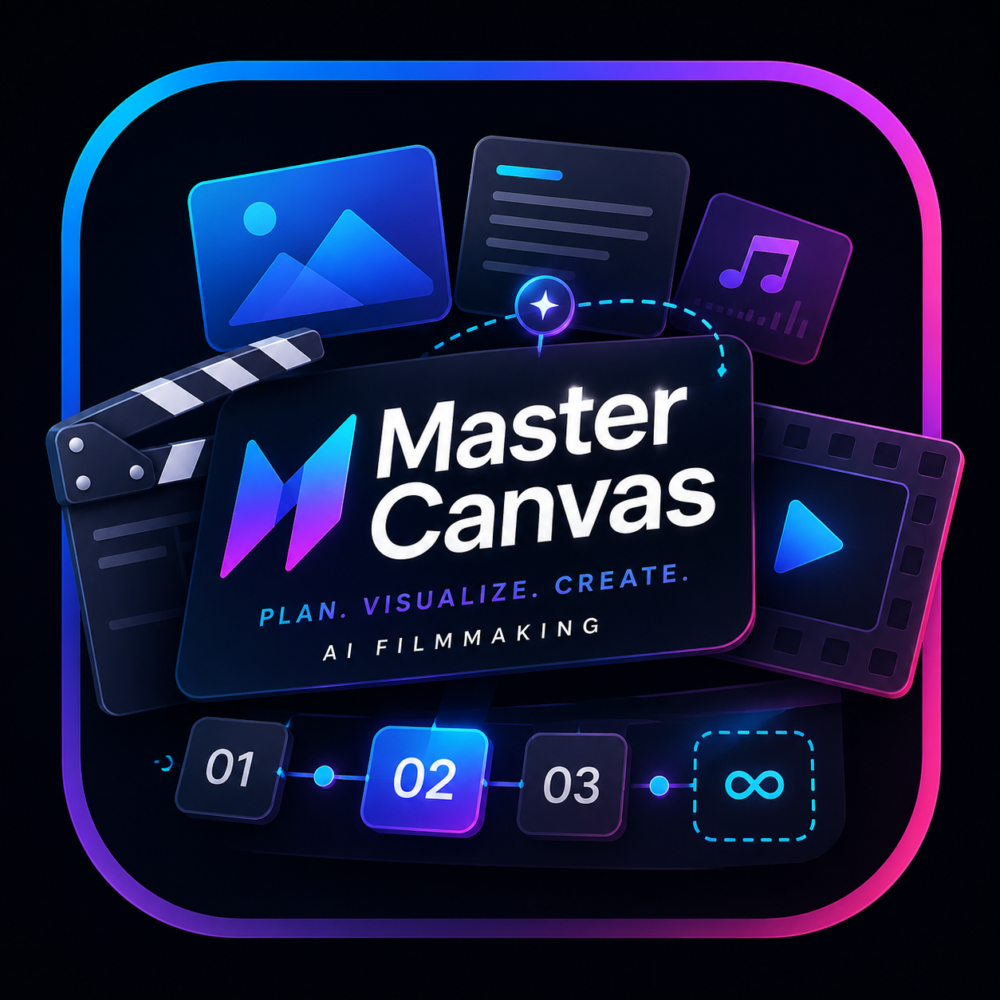
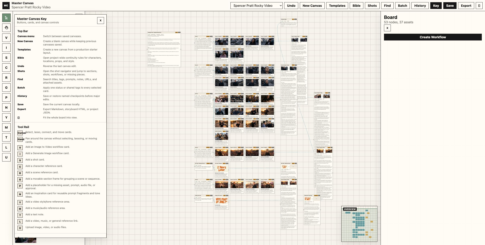
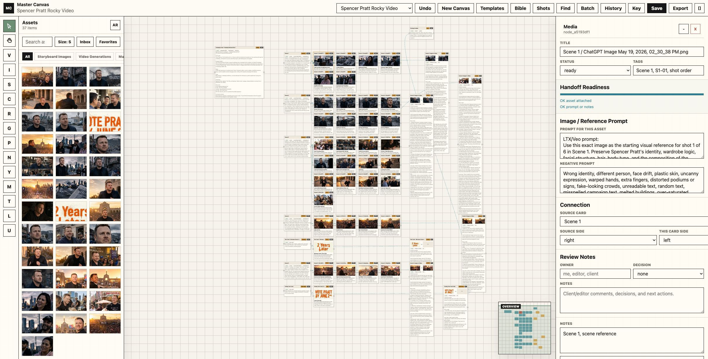

<p align="center">
  
</p>

# Master Canvas

Local-first pre-production canvas for planning AI video projects. Arrange images, prompts, references, music notes, shot order, and generation handoffs on a visual board.

Developed by Sam Wasserman: [WassermanProductions.com](https://wassermanproductions.com) and [Wasserman.AI](https://wasserman.ai). Released under the MIT License.

Master Canvas ships without bundled demo projects, private media, or sample user assets. New users start with a blank local canvas.

## Preview

These screenshots show an example production board with assets, shot cards, prompts, references, handoff readiness, the movable help key, and the minimap overview. The app itself starts blank for new users.





## Features

- Infinite visual canvas with zoom, pan, lasso selection, grouping, and node connections.
- Local asset library for images, video, audio, links, style references, and music references.
- Per-shot prompts, negative prompts, lenses, lighting, camera movement, action, sound notes, and review notes.
- Handoff exports for Markdown, JSON, visual storyboard HTML, storyboard PDF, and a ZIP package for agents/operators.
- Handoff ZIP includes Hermes Agent context, ComfyUI/LTX job JSON, Kling/Veo prompt sheets, source assets, shot order CSV, and scene bin plan.
- Local-first storage in the user's browser/Electron app. No account or cloud service is required.

## Privacy

All project data is stored locally in the user's browser or desktop app storage. The app does not include a backend and does not upload files anywhere. Exported ZIP/PDF/HTML/JSON files are created locally by the user.

## Web App

```bash
npm install
npm run dev
```

Open the local URL printed by Vite.

## Desktop App

```bash
npm install
npm run desktop
```

Package a desktop build:

```bash
npm run desktop:dir
```

Create distributable installers:

```bash
npm run desktop:dist
```

Installer output is written to `release/`.

For unsigned local builds on macOS, use `npm run desktop:dir`. For public distribution, sign and notarize the macOS app with your own Apple Developer ID.

More details:

- [Usage Guide](docs/USAGE.md)
- [Desktop Packaging](docs/DESKTOP.md)
- [Release Guide](docs/RELEASES.md)
- [Hermes Plugin](docs/HERMES.md)

## Publishing To GitHub

This repository is set up to start from a blank canvas. Demo/private project assets are not required for the app to run.

Recommended before publishing:

- Decide whether packaged releases should be built manually or through GitHub Actions.
- Keep private project handoff ZIPs out of the repo.

## Agent control (MCP)

Any MCP agent — **Hermes, Claude Code, Codex, or any other MCP client** — can read and edit a Master Canvas project (boards, cards, prompts, references, shot order, assets) and build generator-ready handoff packages **headlessly**, without the desktop app. It operates on the app's exported `master-canvas-project.json` (export from the app → let the agent work → re-import). The server lives in [`mcp/`](mcp/) here and is also published standalone as [**master-canvas-mcp**](https://github.com/wassermanproductions/master-canvas-mcp).

```bash
# Claude Code
claude mcp add master-canvas -- node /absolute/path/to/master-canvas/mcp/master-canvas-mcp.mjs
```

See [`mcp/README.md`](mcp/README.md) for the full tool list and Hermes/Codex/generic setup.

## Hermes Agent Plugin

A starter native Hermes plugin lives in:

```text
plugins/mastercanvas-hermes
```

It lets Hermes inspect/extract Master Canvas handoff ZIPs and turn them into a ComfyUI/LTX execution plan. Copy that folder into `~/.hermes/plugins/master-canvas` and restart Hermes.
